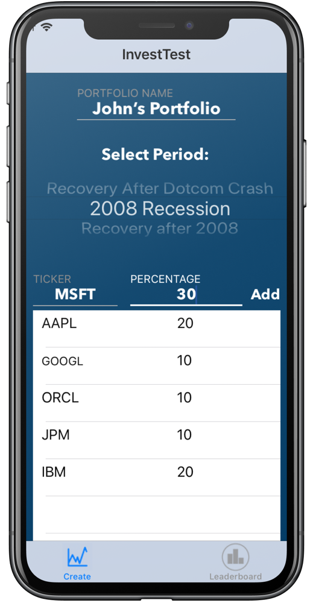
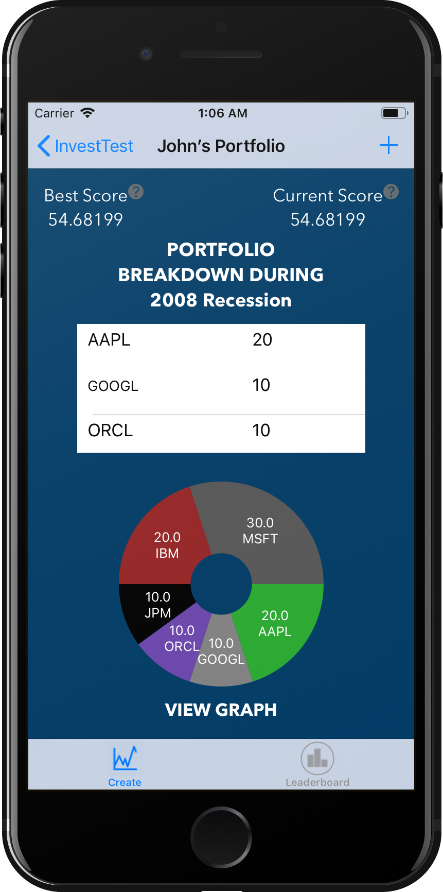
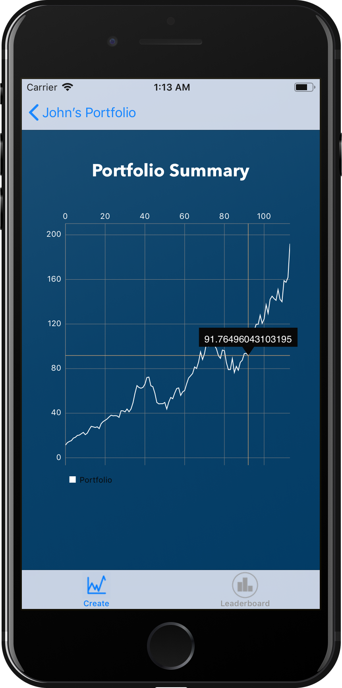

# Invest Test

## Description
Managing your own finances and investing your savings are exciting but daunting moments for college students entering a new walk of life in adulthood. More often than not, young people learn how to trade equities in the securities market the hard way, with gut-wrenching losses resulting in a scarring disappointment. Utilizing a comprehensible database of various historical stock and fund performances, the app InvestTest allows users to create their virtual portfolio of investments and test their investment philosophies with past scenarios.

Using an API called Aladdin by Blackrock, we allow the user to select a virtual portfolio of certain stocks, ETFs, and mutual funds. They can then test their portfolio’s performance during a certain given interval of time, such as during the 2008 financial crisis. Once the user finalizes the desired portfolio of securities, the app displays the total performance chart, a pie chart of the portfolio compositions, and how they performed against the S&P500 Index. The app is configured to allow the user to continue editing his or her portfolio to try and achieve the highest returns possible and also to compete with other players testing their portfolios during the same interval – with the ultimate goal of rising to 1st place in the displayed leaderboard.

We built the mobile application using XCode, specifically so that users could end up challenging their friends easily and we wanted to learn iOS development as a team. We used BlackRock's API for the portfolio data, and used CocoaPods such as AlamoFire and SwiftyJSON for parsing the data. Additionally, we used SkyFloatingTextFields to improve the UI and the Charts pod to display pie charts and line charts with the data from the API.

## Screenshots
|         |         |            |   |
| :-------------: | :-------------: | :-------------: | :-------------: |
| Create Portfolio | View Breakdown | Portfolio progress | Leaderboard |

## Acknowledgements
* Created by Vaibhav Gattani, Nicholas Sambold, Melanie Cooray & Yoseop Hong
